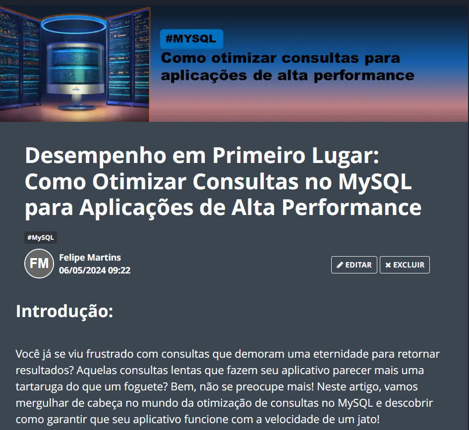

    

  
  

-------

  

# Projeto artigo técnico gerado por I.A.s

  

Projeto com o objetivo de gerar um artigo técnico com um layout rico, leitura agradável e com foco em promover sua autoridade técnica.

<a href="https://web.dio.me/articles/desempenho-em-primeiro-lugar-como-otimizar-consultas-no-mysql-para-aplicacoes-de-alta-performance?back=%2Farticles&open-modal=true&page=1&order=oldest" title="View PDF now"> 📕Clique aqui para ler o artigo</a>

## 💻 Tecnologias utilizadas no projeto

- [ChatGPT](https://chat.openai.com/) - para título e conteúdo
- [Lexica.art](https://lexica.art/) - para gerar imagens
- [PowerPoint](https://www.microsoft.com/en/microsoft-365/powerpoint) - Para formatação de banners e Layouts

## 📄 Prompts e ferramentas

ChatGPT：

|   Ação   | prompt                                                                                                                                                                                                                                                                         |
| :------: | ------------------------------------------------------------------------------------------------------------------------------------------------------------------------------------------------------------------------------------------------------------------------------ |
|  título  | Crie 10 headlines para nomes de artigos sobre o assunto de melhores práticas para otimização de consultas no MySQL                                                                                                                                                                                                    |
| conteúdo | Faça um texto para ebook , com foco em MySQL, listando os principais conteúdos para uma otimizaçao de alta perfomance com exemplos em código {REGRAS} Explique de maneira informal, Deixe o texto resumido, Forneça exemplos de códigos perfomáticos , coloque 3 hashtags ao final do artigo |

Lexica.art：

- No léxica utilizamos o acervo público de imagens geradas por outras pessoas, os termos de pesquisa que utilizei durante a gravação do conteúdo foram:

• MySQL

## ✨ Features

- Conteúdo gerado via ChatGPT
- Imagens do acervo público geradas via Lexica.art

## 📚 Materiais

- prompts utilizados

## 🛠️ Instruções de execução

Utilize os prompts acima nas ferramentas sugeridas para gerar o material base e utilize uma ferramenta de edição de documentos como power point, libreoffice , indesign para diagramação, o passo a passo em vídeo pode ser conferido na plataforma da [DIO](https://dio.me).

## 👨‍💻 Expert

    
&nbsp&nbsp&nbspFelipe Martins 
    &nbsp&nbsp&nbsp
    <a href="https://github.com/felmartins1985">
    GitHub</a>&nbsp;|&nbsp;
    <a href="https://www.linkedin.com/in/felmartins1985/">LinkedIn</a>

---